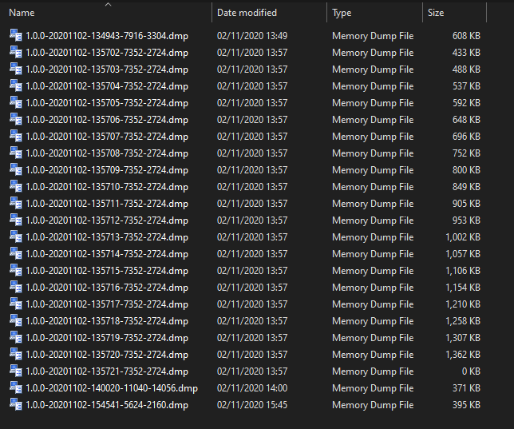
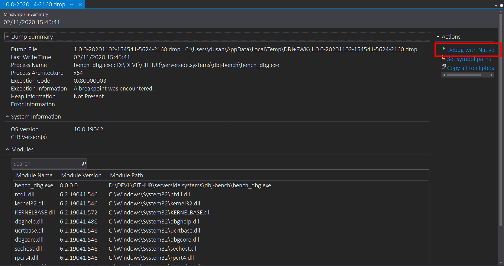
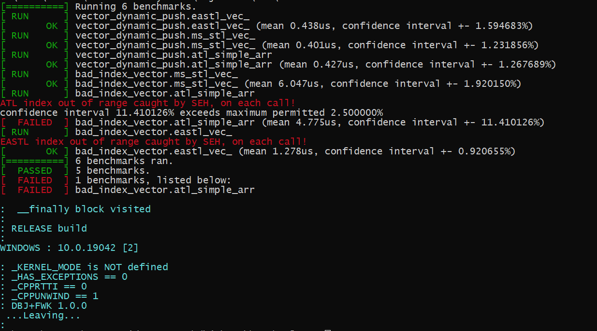

# DBJ+FWK

Non Ambitious Windows App Framework

&copy; 2020 by dbj@dbj.org

> Purpose is to encapsulate and decouple, top level [SEH](https://en.wikipedia.org/wiki/Microsoft-specific_exception_handling_mechanisms) handling.

Why would anybody care for that? 

SEH is intrinsic part of Windows. It is also intrinsic part of Microsoft C/C++ compiler, a.k.a. CL (cl.exe). Thus it is always there. In any kind of Windows executable.

By managing raised Structured Execeptions (SE) in your main you are in total control. C or C++. Stack overflow, division with zero, etc. All this "things" and more, are caught by the SEH. You just have to handle them.

In here we have encapsulated all of that for you. 

We create a minidump in case of SE caught. You are informed with full path where is that *.dmp file saved. 

All the dmp (aka minidump) files are stored in 

```
%TEMP%\DBJ+FWK
```



Each minidump creation creates a new minidump. You can easily see the time stamp in those file names.

At this stage you need Visual Studio 2019. Community edition is free. You can open the last dmp or any of them using Visual Studio 2019. Just double click on it. And then you will see the highly technical details:



Perhaps not very usefull for 99% of population. But in the upper right corner there is that "Debug with Native" link.

Click on that and you will be taken to the exact location of the cause for which SE was raised. And that is immensely usefull. 

### Remember

this is not C++ exceptions. This is OS native exceptions. Thus it can catch "anything" wrong you or anybody can (and will) do. Much more than disciplined C++ ans use of C++ exceptions can and will. And it is always there. 

**DBJ+FWK** makes it much easier for you to use this functionality (temporarily or not ) and focus on your code. Desktop UI app or console, it does not matter.

### The real life use-case

We use this as a permanent host for our testing and benchmarking code. Which is for us always a console app. Thus in that mode, we also pinpoint a much more of issues and bugs while developing, than uspreviously possible. 



[dbj-bench](https://github.com/dbj-data/dbj-bench/tree/master) in action. Basically a combination of our fork of [UBENCH](https://github.com/dbj-data/ubench) and DBJ+FWK.

## How to use

This is Windows 64 bit, static lib project.  To use it in your projects, you just need to provide implementation of one function (and link the lib of course):

```cpp
// user code starts here
// this is called from DBJ+FWK
// lib where SE handling  and 
// minidump creation is implemented
extern "C" int program (int argc , char ** argv ) 
{
  return 42;
}
```

Windows desktop App users need also to include `dbj_fwk.h`. 

Example usage project [DBJWINAPP](https://github.com/dbj-data/dbjwinapp) contains the `program()` entry point for standard Win32 UI desktop app. It is in the `program.cpp`.

You command line switches will also work. It is simply you do not start from your main any more.

Yes, that might seem as a bad idea; `main()` is inside this library. But you still have the total control; it is only the focus is on your program. What comes before the `program()` function, is the infrastructure you do need *and* you do not want to get involved with.

This is to be built as VStudio 2019 solution

### As ever we do only 

- x64 builds
- use static runtime library '/MT' or /MTd' for debug builds

## Details & Recap 

- Windows code only
- on SE raised and caught **anywhere** this fwk will
	- catch the SE
		- do the `__finally` block
		- create the minidump on the local machine
		- inform the user where is this miniidump and how is it called
- Visual Studio (2019) opens and uses the minidump files
	- part of that experience is VS native debugging, allowing you to pinpoint the exact issue
	- In case you missed it: 
    	- SEH is not C++ exceptions
    	- SEH is present in any Windows executable
    	- SEH catches **everything** : stack abuse, division with zero and a such
        	- there are no standard C++ code for that
    	- SEH works with C code too
    	- And "the 'gasp!' moment"
    		- MS STL is raising SE when 
		`_HAS_EXCEPTIONS == 0`
		- yes you think that right,
		in that scenario:
    		- MS STL is not using C++ exceptions
    		- `try`/`throw`/`catch` are forbiden 
    		- In that scenario MS STL is **not** ISO standard 


When building this lib if `DBJ_FWK_DISPLAY_INFO` if defined, it provokes this bold blue info at the end of the app using DBJ+FWK.

Here is our own benchmarking console app screen dump:


If you do want or not want that seen at compile time use this switch `DBJ_FWK_DISPLAY_INFO`. Absence of this will result in no info display.

## The Roadmap

DBJ+FWK can be used in WIN desktop App. In that case there is no console and stdio does not work. Thus we have to use logging. No logging no output. The plan is to log into the file for Windows App hosts.

We wil decouple the logging component choice, so that users might use their own.

Following is undecided as it compromises the stability :

- user definable SEH finally callbacks
- user definable SEH catch all callbacks

## PS

Please respect the [license](.LICENSE.MD)


[Serverside Systems](https://github.com/dbj-data) is part of [dbj.systems](.https://dbj.systems) group.


dbj.systems, London, UK.
